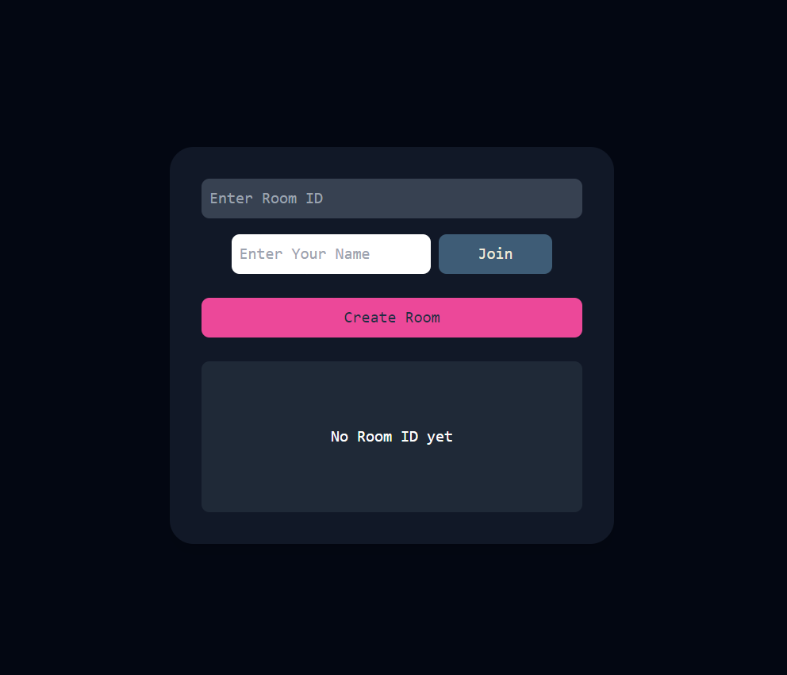

# Teching Screenshot

- 

# Room id setup
- user will click on create room button and will get a room id :
    - the encapsulation is like by clicking on create button user sends a post requeest to /create-room on the backend and it responses back with a room id
    - This room id will be set and we will check if their is no active connection with this room id for 10 seconds then we clean the roomId state on the frontend 
